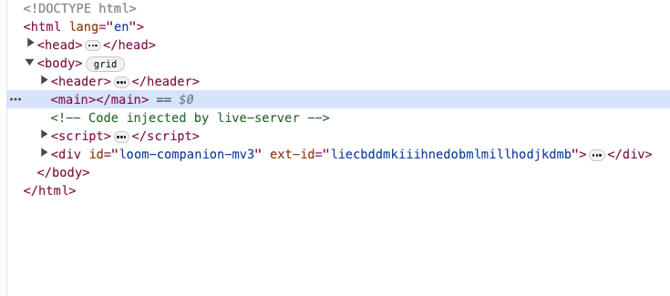
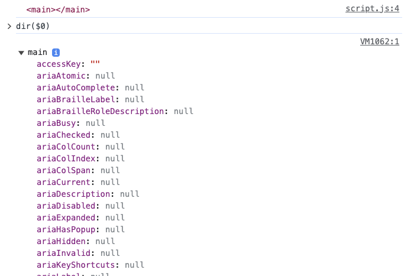

# Using Dev Tools

To view all the DOM properties of DOM ELEMENT of mainEl do the following:

1. In the Elements tab of Dev Tools click on the element you want to view

Notice how there is a == $0

2. In the Console tab of the Dev Tools type `dir($0)`

Output should be

3. View all the possible DOM properties for the mainEl